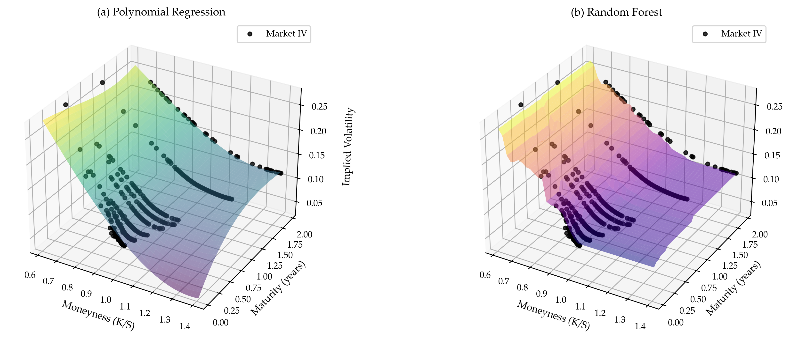
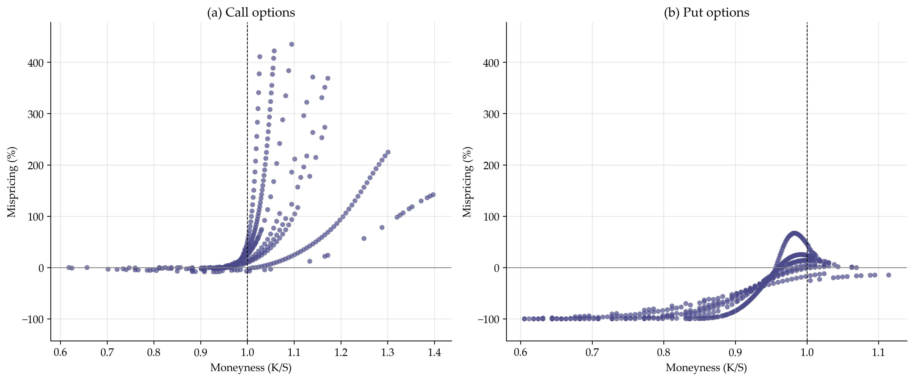
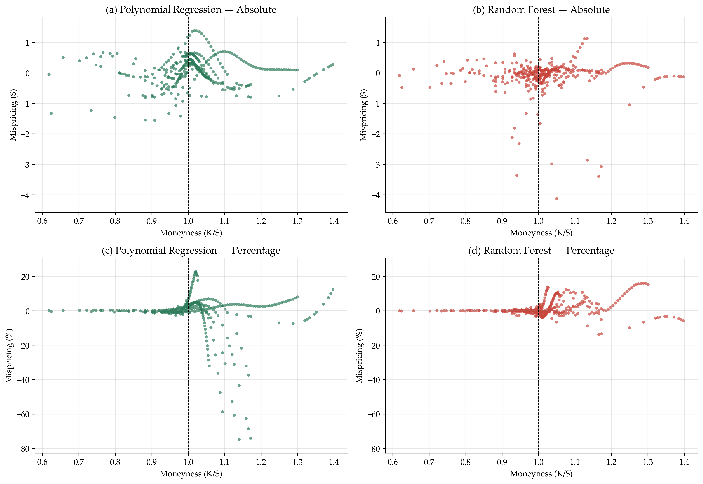

# Estimating the Implied Volatility Surface

Quantifying and reducing Black-Scholes-Merton mispricing on real SPY options data, using polynomial regression and Random Forest to estimate the implied volatility surface.

**[Read the full report (PDF)](report.pdf)**

## The problem

BSM assumes volatility is constant across strikes and maturities. Real markets violate this systematically: options on the same underlying, with the same expiration, imply different volatilities at different strikes.

Pricing with a single historical volatility therefore produces a large and structured error, up to 320% of an option's market price in this dataset. This project measures that error and reduces it by estimating the volatility surface from market data, instead of assuming a constant.

## What it does

1. Prices European options with dividend-adjusted BSM (Merton's extension, since SPY pays dividends)
2. Measures the mispricing against real market prices, using historical volatility as the naive input
3. Extracts the implied volatility of every option numerically, via Brent's method
4. Fits the IV surface over moneyness and maturity with two models: polynomial regression with a Ridge penalty, and Random Forest
5. Re-prices every option with the estimated IV and compares the residual error

## Results

Percentage mispricing drops by roughly an order of magnitude, from a maximum of 320% to 65%.

| Model | Call RMSE | Put RMSE |
|---|---|---|
| Polynomial regression | 0.00643 | 0.00552 |
| Random Forest | 0.00321 | 0.00532 |

Random Forest wins clearly on calls but only marginally on puts. Neither model dominates: the polynomial surface is smoother and generalises better at scale, while Random Forest tracks observed points more closely but turns stepped where data is sparse. Model selection turns out to be data-dependent, which is a more interesting result than either RMSE on its own.



*Estimated volatility surface for call options: (a) polynomial regression, (b) Random Forest.*



BSM absolute and percentage mispricing, the error the models reduce.*



*Residual mispricing for call options after re-pricing with the estimated IV.*

## Data

- **Underlying:** SPDR S&P 500 ETF Trust (SPY), chosen for high liquidity and no idiosyncratic single-stock effects
- **Source:** Yahoo Finance via `yfinance`, intraday snapshot
- **Coverage:** eight maturities (short, mid, long-term), calls and puts as separate datasets
- **Filters:** non-zero bid/ask, minimum volume and open interest, minimum price, and moneyness restricted to [0.6, 1.4]. Outside that range vega approaches zero and the IV solver becomes numerically unstable.

## Files

```
README.md
report.pdf              Full write-up: methodology, results, discussion
requirements.txt
analysis.ipynb          End-to-end analysis, produces every figure
bsm.py                  Pricing, d1/d2, vega, implied volatility solver
data.py                 Download, filtering, baseline mispricing
models.py               Surface fitting and model predictions
plots.py                All figures
figures/                Generated plots
```

## Running it

```bash
pip install -r requirements.txt
jupyter notebook analysis.ipynb
```

Run it during US market hours. Outside them many contracts quote zero bid/ask and get dropped by the liquidity filters. Results will differ from the report, which uses a snapshot from 7 August 2026.

## Known limitations

Covered in full in the report. The main ones:

- Single-day snapshot on a single underlying, so there is no evidence the surface generalises across time or assets
- The train-test split is random rather than temporal, so out-of-sample performance under different market conditions is untested
- SPY options are American-style while BSM prices European options. The early-exercise premium is not captured, as confirmed by a residual deviation in the put-call parity check
- The surface is only valid within the filtered moneyness and maturity ranges

## References

- Black, F., Scholes, M. (1973). *The Pricing of Options and Corporate Liabilities.* Journal of Political Economy, 81(3), 637-654.
- Merton, R.C. (1973). *Theory of Rational Option Pricing.* The Bell Journal of Economics and Management Science, 4(1), 141-183.
- Hull, J.C. (2021). *Options, Futures, and Other Derivatives* (11th ed., Global Edition). Pearson.
